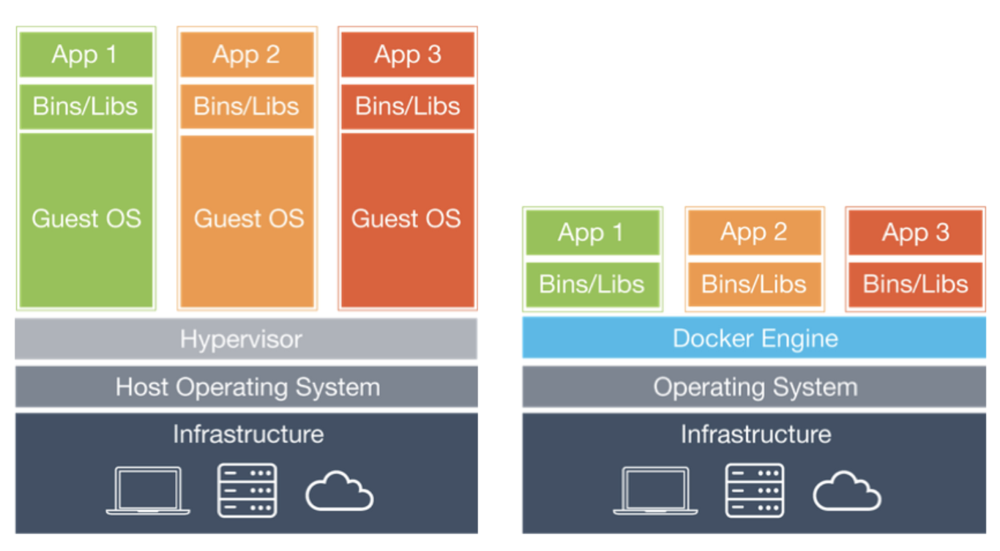

## 도커의 작동 원리

### 가상화와 컨테이너 구조의 그림 비교

(출처 : [링크](https://medium.com/@darkrasid/docker%EC%99%80-vm-d95d60e56fdd))

- (VM(가상머신)과 비교했을 때)
- 컨테이너는 하이퍼바이저와 게스트 OS가 필요하지 않습니다.
- 컨테이너에는 OS가 포함되지 않기 때문에 수십 MB에 불과합니다.
- 운영체제 부팅이 필요 없으므로 서비스를 시작하는 시간도 짧습니다.
- 크기가 작기 때문에 컨테이너 복제, 배포에도 용이합니다.
- 호스트 OS 위에 애플리케이션의 실행 피키지인 이미지를 배포하기만 하면 됩니다.

### 컨테이너 가상화

1. namespace

   - Linux object에 이름을 붙여 프로세스에 할당
   - Docker는 namespace를 이용하여 호스트 상에서 컨테이너를 가상적으로 격리시킵니다.
   - PID(Process ID)
   - Network(network device, IP, Port, routing table...)
   - UID, GID
   - mount
   - UTS
   - IPC

2. cgroups(control groups)

   - 프로세스 == 하나 이상의 스레드 모음
   - cgroups은 프로세스와 스레드를 그룹화합니다.
   - 그룹 안에 존재하는 프로세스와 스레드에 대한 관리를 수행합니다.
   - (프로세스의 자원을 제한하고 격리시키는 커널의 기능)
   - cpu, memory, devices, net_cls, blkio...
   - 특정 애플리케이션이 자원을 과다하게 사용하는 것을 제한합니다.

3. chroot
   - 특정 디렉토리를 최상위 디렉토리(root)으로 인식되도록 합니다.

### Docker 네트워크 구성

- 서버의 물리 NIC를 docker0 (가상 브리지 네트워크)로 연결합니다.
- 컨테이너가 실행되면 이 컨테이너의 172.x.x.x/16 대역의 프라이빗 IP가 eth0 등으로 기본 할당됩니다.
- 도커 컨테이너가 외부 네트워크와 통신합니다.(NAPT 기능)
- NAPT(Network Address Port Translation)(IP 마스커레이드)

#### 결론: chroot로 특정 디렉토리를 /(root)로 바꾸고, cgroups와 namespace를 통해 자원을 격리, 제한하여 특정 프로세스에 할당하고 제어합니다.
